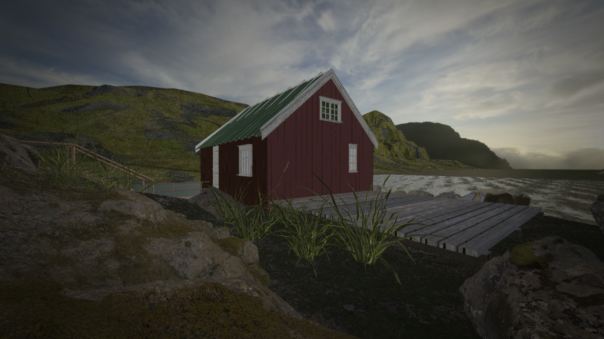

## Retina Engine
A full game engine written in 10-weeks made for my 2019 Capstone project written in C/C++ and DirectX 11.

### Demo
A demo highlighting all features done during the 10-week period can be found here: https://www.youtube.com/watch?v=48_5aoXeIpg&t=66s

**World Editor**
* Quickly update the transforms and components of your objects in real-time without having to close the engine and make adjustments. ImGui being used to provide quick window docking display information for Game Objects

**Physically-Based Rendering with Image-Based Lighting**
* Insight uses a full PBR pipeline for materials. Albedo, Normal, Roughness, Metallic, and Ambient Occlusion maps are all put to use to produce very realistic Surfaces. Specular Image-Based Lighting (IBL) is also used to ground the objects in the scene

**Lua Scripting**
* Lua allows for quick modification to a Game Object's behavior in the scene. Simply add a new Lua Script Component.

**Sphere to Sphere Rigid Body Collision Detection**
* Simple collision detection for rigid body components. Can be used for physics simulation or collision callbacks in Lua scripts for object interaction.

**JSON File IO**
* Save and load your scenes. In the background, JSON is being used to store all Game Objects and their corresponding components

### Physically Based Rendering

**Platforms**
Windows PC (x86_64)
Visual Studio 2019/2017

*This software falls under the MIT license

Copyright (c) 2019 Garrett Courtney

If you use it please give credit
